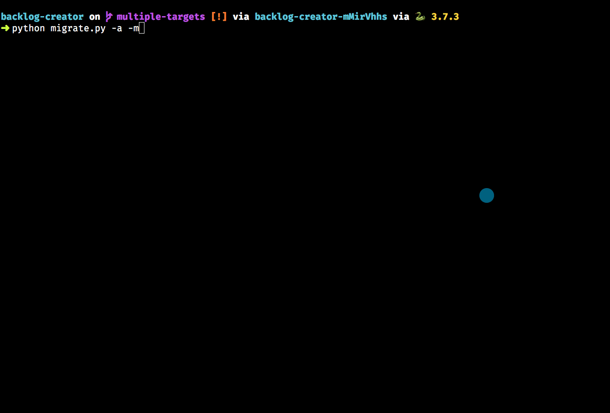
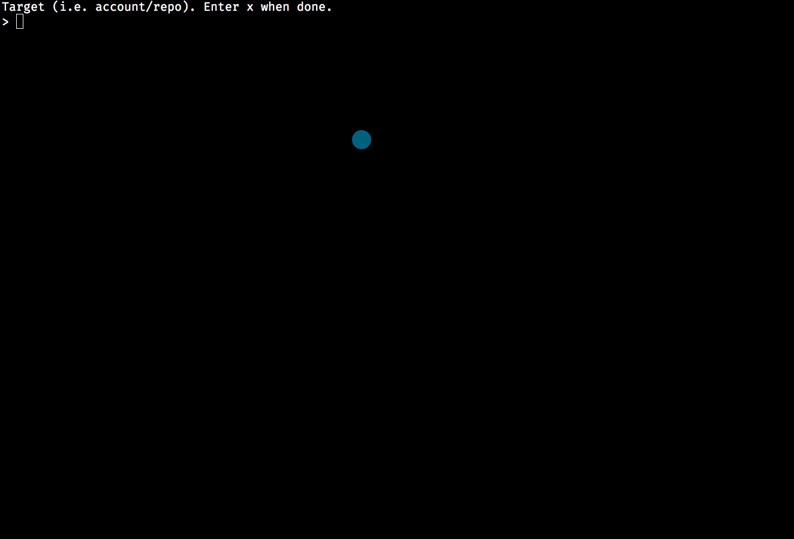

# NSS Project Backlog Creator

This tool will allow instructors to specify one of our source repositories that has issues tickets, and then import them into a student repository, create a project board, and add all of the tickets to the backlog swimlane.


## Prerequisites

Install pipenv with `brew install pipenv`

## Environment

1. Clone this repo
1. Run `pipenv install` to get dependencies
1. Run `pipenv shell` to activate virtual environment

## Configuration

1. Copy `config.ini.sample` to `config.ini` and open the new file.
1. In the login section, enter in your account name and password (no 2FA) or personal access token (needed if you have 2FA). See section below about how to generate a personal access token.
    ```ini
    [login]
    username = your_account
    password = password_or_PAT
    ```
1. Specify the account and repo from which you are importing issues.
    ```ini
    [source]
    repository = nashville-software-school/nutshell
    ```
1. Specify the account and repo(s) to which the issues will be imported.
    #### Specify all targets in config
    Make sure the `target` config is uncommented, and provide a comma-delimited list of target repositories.
    ```ini
    [target]
    repository = nss-cohort-37/callous-capybaras-nutshell,
                 nss-cohort-37/foo-bar-baz-nutshell,
                 nss-cohort-37/chicken-monkeys-nutshell
    ```
    #### Specify all targets during execution
    Comment out the target if you want to enter in the target repos during the execution of the program.
    ```ini
    [target]
    ; repository = nss-cohort-37/callous-capybaras-nutshell
    ```

1. Specify the name of the project board you want to create on the student repository. If you want different swimlanes for tickets, just change the items in the `columns` list.
    ```ini
    [project]
    name = Nutshell
    columns = ["Backlog", "In Progress", "Ready to Test", "Complete"]
    ```

That's all you will need to change each time you run this tool.

> **Note:** The Github API media type section _should_ not change very often, but if you cannot get this tool to work, check the docs and make sure the media type is still valid.
>
> ```ini
> [github]
> media_type = application/vnd.github.inertia-preview+json
> ```

## Running the Migration

### Single Migration

For a single migration, make sure you have a a value for the target repository in the config file, and it is uncommented. To migrate all open tickets from source to target, use the `-a` flag.

```sh
python backlog_migrate.py -a
```

To migrate some of the open tickets from source to target, use the `-i` flag and then the numbers of the tickets. The following command would only migrate 6 specific tickets.

```sh
python backlog_migrate.py -i 2 5 6 9 13 20
```

### Multiple Migrations in a Single Run

If you want to migrate to multiple repos, make sure that the `target` repository value in the config file has **all** of the repositories you want to migrate the tickets to.

```ini
[target]
repository = nss-cohort-37/callous-capybaras-nutshell,
                nss-cohort-37/foo-bar-baz-nutshell,
                nss-cohort-37/chicken-monkeys-nutshell
```

Then use the `-m` flag when you run the program.

```sh
# Migrate all tickets from source to target
python backlog_migrate.py -m -a

# Migrate specific tickets from source to target
python backlog_migrate.py -m -i 2 5 6 9 13 20
```

## Ordering the Issue Tickets

Once the program starts, it will import the issues from the source repository, and then present them to you in a list so that you can order them.

Use the `j` and `k` keys to select issues.

Use the `u` and `d` keys to move issues up and down the order.

Once you are done ordering the issues, press return to continue.




Once you press enter, the issues will be migrated to the target repository, a project board will be created, and the issues added to a Backlog column.



You can continue to add target repositories and run the migration for each one. Once all migrations are done, enter `x` to end the program.

## Creating Retrospective Boards

When your teams are on their last day of the project, you can run this application again to create the retrospective boards and add the columns to it.

Make sure you have the following configuration section in `config.ini` file.

```ini
[retrospective]
name = {Group Project} Retrospective
columns = ["Glad", "Sad", "Kudos"]
```

Then run the application again, but only with the `-r` flag.

```sh
python backlog_migrate.py -r
```

## Deactivating Virtual Environment

When you are done migrating issues to all of your students' repositories, first enter in the command `deactivate` in your terminal to stop the venv. If you later try to activate the venv again and you see the message:

```html
Shell for UNKNOWN_VIRTUAL_ENVIRONMENT already activated.
No action taken to avoid nested environments.
```

Then type in the command `exit` and it should force quit the environment.

## 2FA Setup

> Note: You should have 2FA on your account

If you have 2FA enabled on your Github account, you will need to create a personal access token and put that in place of your account password.

1. Copy `config.ini.sample` to `config.ini`.
1. Open the new file
1. Go to your Github account
1. Open settings
1. Click on Developer Settings
1. Click on Personal Access Tokens
1. Click on Generate New Token
1. Call the new token _Backlog generator_
1. Check all of the checkboxes for permissions
1. Scroll down and click the Generate Token button
1. Copy the token that gets created
1. Paste it into the `password` key in the `config.ini` file.

### More Details

For a list of all possible configuration options in `config.ini`, see [_Configuration_](http://www.iqandreas.com/github-issues-import/configuration/).

Some config options can be passed as arguments. For a full list, see [the the _Arguments_ page](http://www.iqandreas.com/github-issues-import/arguments/), or run the script using the `--help` flag.

